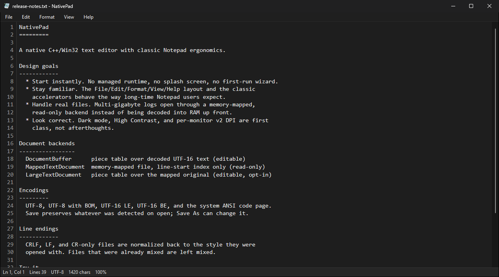
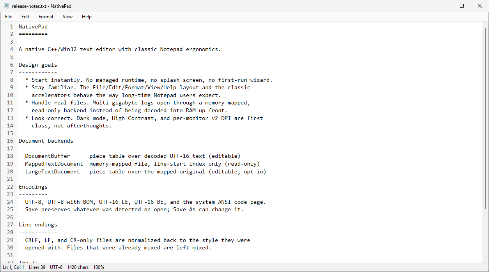
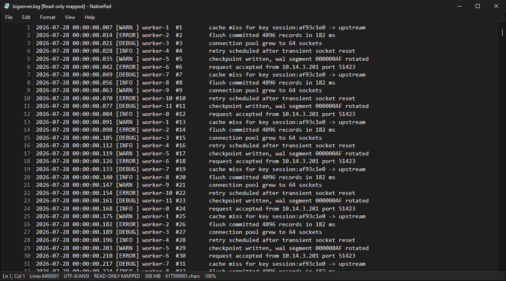
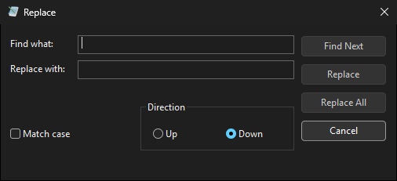
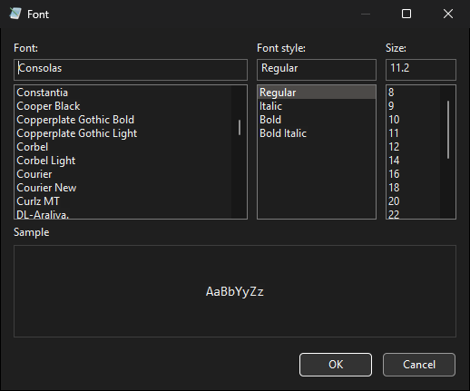

<div align="center">


# NativePad

**A native C++/Win32 replacement for classic Windows Notepad.**

Instant startup, familiar menus and shortcuts, real dark mode, per-monitor DPI,
and multi-gigabyte files that open without loading into RAM.

[](https://github.com/Wimukthi/NativePad/actions/workflows/ci.yml)
[](https://github.com/Wimukthi/NativePad/releases/latest)
[](LICENSE)




</div>

## Why NativePad

Windows Notepad has become a Store-updated app: slower to start, and awkward
with very large files. NativePad keeps the classic command shape and speed, and
adds only what a text editor genuinely needs.

- **Native.** Compiled C++20 against the Win32 API. No managed runtime, no
  bundled framework — a single ~600 KB executable.
- **Familiar.** The classic File / Edit / Format / View / Help layout with the
  accelerators long-time Notepad users already know.
- **Fast on real files.** Files over 512 MB open through a read-only
  memory-mapped backend that indexes line starts instead of decoding the file.
- **Correct on modern Windows.** Dark mode, High Contrast, and per-monitor v2
  DPI are handled throughout, including custom-painted menus and dialogs.
- **Safe with unsaved work.** Dirty documents are journaled in the background
  and offered for restore after a crash.

## Features

| Area | What you get |
| --- | --- |
| Editing | Undo/redo, cut/copy/paste, word/line selection, duplicate line, delete line, move line up/down |
| Search | Find, Find Next/Previous, Replace, Replace All, Go To Line — all with wrap-around and match case |
| Files | UTF-8, UTF-8 BOM, UTF-16 LE/BE and ANSI detection; encoding and line endings preserved on save; Save As can change encoding |
| Large files | Read-only memory-mapped viewing above 512 MB, with opt-in editing through a piece table over the mapping |
| Live logs | Follow Tail (F6) keeps up with a growing file; external edits prompt for reload |
| View | Word wrap, line numbers, status bar, zoom 10–500%, dark mode override |
| Printing | Native Page Setup and Print dialogs; pagination and spooling on a worker thread |
| System | Recent files, per-user `.txt` association, optional update check against GitHub releases |

Full detail: [Feature Matrix](docs/FEATURE_MATRIX.md) ·
[Classic Notepad Parity](docs/CLASSIC_NOTEPAD_PARITY.md)

## Install

Download the latest build from the
[releases page](https://github.com/Wimukthi/NativePad/releases/latest):

- **`NativePadSetup-<version>-win-x64.exe`** — Inno Setup installer. Adds a
  Start Menu shortcut and an optional desktop shortcut, and updates in place.
- **`NativePad-<version>-win-x64.zip`** — portable. Extract and run
  `NativePad.exe`; nothing is installed, and preferences are written to
  `%LOCALAPPDATA%\NativePad\NativePad.ini`.

Requires 64-bit Windows 10 or later. Releases are currently unsigned, so
SmartScreen may warn on first run.

To make NativePad your default text editor, use **Help > Set as Default
Editor**, then confirm the change in the Windows Default Apps page that opens.

## Screenshots

| Light mode | Large file, read-only |
| --- | --- |
|  |  |

| Replace | Font |
| --- | --- |
|  |  |

## Build from source

Requires Visual Studio 2026 (MSVC `v145` toolset) and a
[Wimukthi.Win32Theme](https://github.com/Wimukthi/Wimukthi.Win32Theme) checkout
beside this repository:

```text
Software\
  NativePad\
  Wimukthi.Win32Theme\
```

From a Developer PowerShell:

```powershell
MSBuild.exe .\NativePad.sln /p:Configuration=Release /p:Platform=x64 /m
```

Then run the app and its tests:

```powershell
.\bin\x64\Release\NativePad.exe
```

```powershell
.\bin\x64\Release\NativePad.Tests.exe
```

Full instructions, including a non-default framework location, are in
[Build and Test](docs/BUILD_AND_TEST.md).

## Documentation

| Document | Contents |
| --- | --- |
| [Usage](docs/USAGE.md) | Menus, keyboard shortcuts, status bar, settings file |
| [Build and Test](docs/BUILD_AND_TEST.md) | Toolchain, build commands, test suite, CI |
| [Architecture](docs/ARCHITECTURE.md) | Module map, document backends, threading |
| [Large Files](docs/LARGE_FILES.md) | Mapped and editable large-file paths |
| [UI and Theming](docs/UI_AND_THEMING.md) | Dark mode, DPI, custom-painted surfaces |
| [Feature Matrix](docs/FEATURE_MATRIX.md) | Implemented features and known limitations |
| [Classic Notepad Parity](docs/CLASSIC_NOTEPAD_PARITY.md) | What matches classic Notepad, what differs |
| [Installer](docs/INSTALLER.md) | Inno Setup packaging and install behavior |
| [Versioning](docs/VERSIONING.md) | Four-part version scheme and auto-increment |
| [Release Checklist](docs/RELEASE_CHECKLIST.md) | Manual verification before publishing |

Start at [docs/README.md](docs/README.md) for a guided reading order.

## Contributing

Bug reports and pull requests are welcome. Read
[CONTRIBUTING.md](https://github.com/Wimukthi/NativePad/blob/main/CONTRIBUTING.md)
first — it covers the code style, the translation-unit layout, and the manual UI
testing this project expects.

Security issues go through
[SECURITY.md](https://github.com/Wimukthi/NativePad/blob/main/SECURITY.md), not
the public issue tracker. Release history is in [CHANGELOG.md](CHANGELOG.md).

## License

NativePad is licensed under the GNU General Public License v3.0 — see
[LICENSE](LICENSE). Third-party components and their licenses are listed in
[THIRD_PARTY_NOTICES.md](THIRD_PARTY_NOTICES.md).
