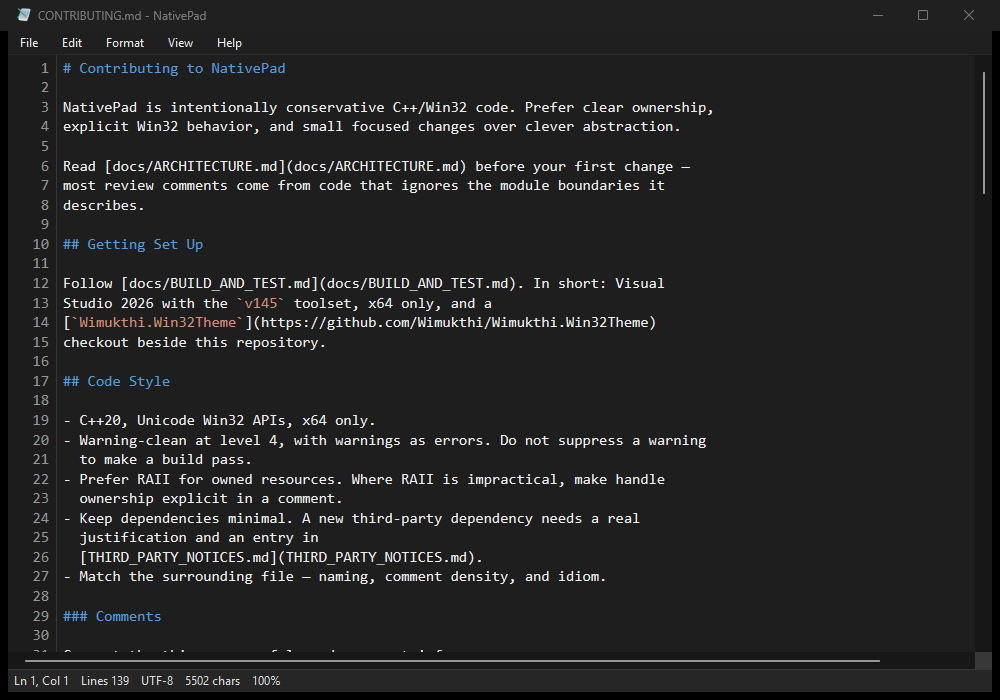

# UI and Theming

NativePad uses native Win32 controls wherever a native control looks right, and
custom-paints the surfaces that Windows will not theme coherently in dark mode:
the menu strip, tab strip, popup menus, status bar, dialog backgrounds, and the
editor.

| Dark | Light |
| --- | --- |
|  |  |

Classic layout with **View > Tab Bar** cleared:

## Division of Responsibility

`Wimukthi.Win32Theme` — the sibling framework — owns everything generic:

- Windows-version detection and the undocumented UxTheme entry points.
- Process-wide and per-window dark-mode opt-in.
- DWM title-bar theming and native common-control theming.
- Runtime system-theme notifications and the High Contrast fallback.

NativePad owns everything specific to NativePad:

- Colour palettes, via `ColorsForTheme` and `DialogColorsForTheme`.
- DPI scaling and owner-draw helpers, in `src/UiSupport.*`.
- Owner-draw painting for the editor, menu strip, tab strip, popup menus, status bar,
  dialog backgrounds, and the Font dialog's sample preview.

**Do not** add registry, DWM, or UxTheme workarounds to NativePad. If a
reusable Windows control needs more coverage, extend the framework instead.

## Dark Mode

NativePad follows the system app theme by default. **View > Dark Mode** forces
one theme, and the override persists in
`%LOCALAPPDATA%\NativePad\NativePad.ini`.

Under Windows High Contrast, the framework restores native system rendering for
standard controls and NativePad's custom surfaces switch to `GetSysColor`
values.

## DPI

The manifest requests per-monitor v2 DPI awareness. Layout code scales
constants through `ScaleForDpi`. Dialog and editor code should not use
hard-coded physical pixels unless the value is genuinely device-pixel based.

## Dialogs

NativePad custom-paints five dialogs — About, Go To, Find/Replace, Font, and
message prompts. OS-owned dialogs (file open/save, Page Setup, Print) stay
native.

| Replace | Font |
| --- | --- |
|  |  |

The child controls are standard Win32 controls attached to the framework:
buttons, default buttons, check boxes, radio buttons, group boxes, text boxes,
read-only text boxes, static labels, list boxes, and list-box scrollbars all get
the shared theme classes, subclasses, colours, and focus/disabled/High Contrast
states from `Wimukthi.Win32Theme`.

NativePad-owned confirmations, errors, and informational prompts go through
`MessageDialog` so save prompts and Yes/No questions follow the app theme.
Their icons are 256 px PNG resources decoded to the current DPI size through
WIC, rather than system icons stretched from a low-resolution source.

### Conventions

- Call `ApplyThemedDialog` after every child control is created.
- Call `RefreshThemedDialog` after a live theme or system-colour change.
- Use the single-pixel `WS_BORDER` style on edit and list controls. Avoid
  `WS_EX_CLIENTEDGE`, which opts into the framework's wider non-client
  focus/hover border intended for roomier form layouts.
- Use `WS_CLIPSIBLINGS` where resize paint artifacts are likely.
- Rely on the native DWM frame and shadow. Do not add separate shadow helper
  windows around dialogs — they do not match the DWM-rounded frame and read as
  extra window chrome.
- Do not write dialog-local owner-draw code for standard controls.

## Menu Strip and Popup Menus

The menu strip is a custom child window, not the built-in menu bar. Popup menus
are owner-drawn so item text, accelerator text, separators, selected rows,
disabled text, and borders all match the active theme.

Popups are no-activate top-level windows with a click-through layered shadow
window behind them, which keeps the shadow visible in dark mode while preserving
standard Win32 active-window behavior. When a popup holds mouse capture, an
outside right-click is re-resolved against the main window and reposted as
`WM_CONTEXTMENU`, so the editor context menu can open without leaving the
top-level menu stuck.

The strip also emulates the standard keyboard cues: `Alt` or `F10` reveals
top-level mnemonic underlines and moves focus into menu navigation until `Esc`
or a menu command leaves that mode.

## Tab Strip

`TabStrip` is one 30-DIP, double-buffered child HWND between the menu and
editor. Antialiased rounded top edges, a contrasting surface, and an accent line
identify the selected tab, while the New Tab button sits directly after the
visible tabs. The strip paints every tab, dirty marker, close button, and
overflow control itself; there are no per-tab child controls. Inactive tabs own
no render target or editor HWND.

Tab widths are DPI-scaled and capped. When the available width cannot hold the
minimum tab width, left/right buttons scroll the visible range and the active
tab is brought into view automatically. Hover tooltips expose full paths when
the displayed basename is truncated or ambiguous. Close and New Tab controls
use Direct2D antialiasing with rounded hover surfaces. High Contrast uses the
same system-colour fallback as the other custom surfaces.

**View > Tab Bar** hides the child window and removes its height from layout;
the editor then begins immediately below the menu strip. This visibility choice
is persisted without changing tab ownership or session behavior.

## Editor Surface

The editor is a child HWND registered by `EditorView`, rendered with a Direct2D
render target and a DirectWrite text format, using theme-supplied background,
text, selection, caret, and gutter colours. Recognized JSON, INI, Markdown, and
XML documents add a small set of theme-aware token brushes (keywords, strings,
numbers, comments, and punctuation); High Contrast collapses those accents back
to the system editor text colour.

Line numbers are an optional gutter: visual only, right-aligned, DPI- and
font-aware, and showing an arrow cursor rather than the text insertion cursor.

Scrollbars are native, with the framework's theme class applied. The status bar
is owner-drawn and reports line, column, logical line count, encoding,
read-only state, file size where applicable, character count, and zoom.
Non-editor chrome uses the arrow cursor; the I-beam is reserved for the editor
text area.

Wheel, native scrollbar, caret, and resize paths all clamp to the last complete
page, so a document that fits cannot be scrolled into empty space. During mouse
selection, capture plus a short UI timer extends the selection and scrolls at a
bounded speed while the pointer remains outside the client area.

## Painting Checklist

When you change UI code, check:

- Dark mode, light mode, and Windows High Contrast.
- 100%, 125%, 150%, and 200% DPI, plus dragging between mixed-DPI monitors.
- Dialog resizing.
- Message prompt icons at 150% and 200%.
- Themed list boxes: scrolling, focus, and selection states.
- Buttons: hover, pressed, default, disabled, and keyboard focus.
- Tabs: active, hover, dirty, close, overflow, middle-click, keyboard cycling,
  and hidden/visible layout.
- Check and radio controls: checked, unchecked, focused, and disabled.
- Popup menus: hover, disabled items, and separators.
- The editor context menu, including that it shows the arrow cursor.
- Horizontal and vertical scrollbars, including fit-to-viewport clamping and
  drag-selection autoscroll beyond every edge.
